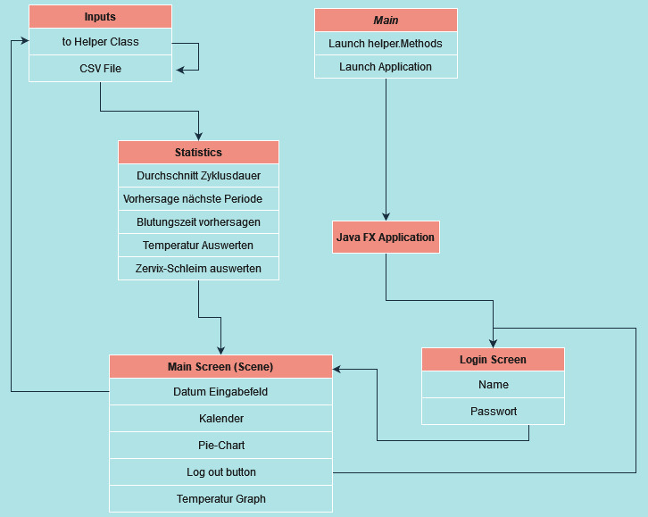
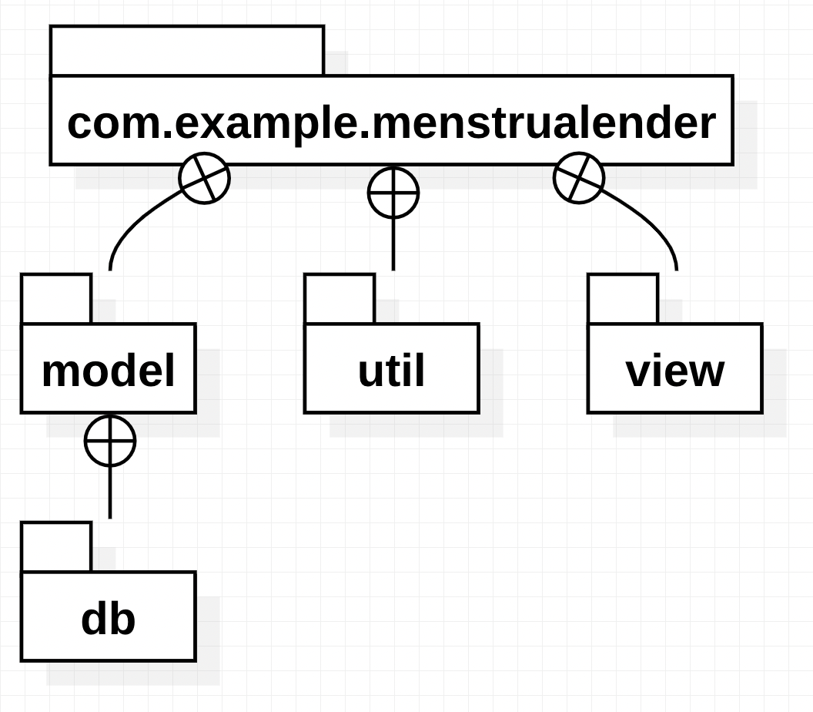
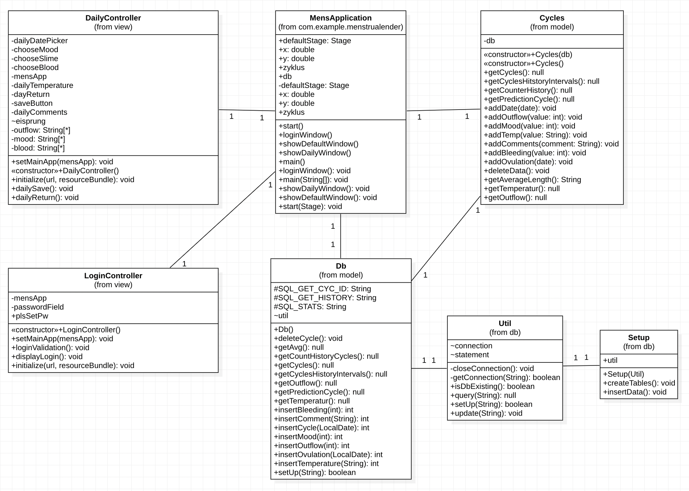
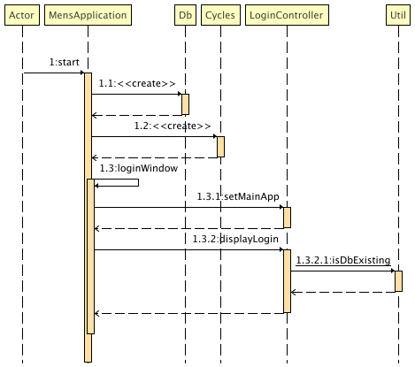

# Inhaltsverzeichnis
1. [Einleitung, Ziele, Randbedingungen](#introduction)
   1. [Einleitung](#subparagraph1)
   2. [Ziele](#subparagraph1)
   3. [Randbedingungen](#subparagraph1)
2. [Build-Anleitung (checkout, mvn ...., java -jar xxxxx.jar)](#paragraph1)
3. [Kurze Bedienungsanleitung](#paragraph2)
4. [User Stories inkl. Akzeptanzkriterium, Aufwandschätzung in Story-Points und Priorisierung](#paragraph3)
5. [Releaseplan mit den Ausbaustufen](#paragraph4)
6. [ Dokumentation Sprint 1 & 2 ](#paragraph5)
   1. [Taskliste Sprint 1](#subparagraph1)
   2. [Taskliste Sprint 2](#subparagraph1)
   3. [UML Package, Klassen- und Sequenzdiagramm](#subparagraph1)
   4. [Code Snippets](#subparagraph1)
   5. [Testfälle aus den Akzeptanzkriterien](#subparagraph1)

# 1) Einleitung, Ziele, Randbedingungen 
## 1.1) Einleitung 
Wenn sie eine einfacheren Weg suchen ihre Menstruationsdaten aufzuschreiben dann werden wir das perfekte Tool für sie erfinden. Einen Online Kalender der ihnen basierend auf früeheren Ergebnissen eine Vorhersage für ihren nächsten Zyklus machen wird.
## 1.2) Ziele 
Das Ziel wird es sein ein Tool zu schaffen, das einfach von Gebrauch ist, aber das Ihnen auch im Alltag helfen. Keine Probleme mit dem vergessen von den vorherigen Zyklen. Andererseits auch ein Tool das ihre Daten geschützt behaltet und sie nach einer vorgegebenen Zeit löscht.
## 1.3) Randbedingungen 
- Die Programmierung der Anwendung erfolgt in Java.
- Das Projekt ist auf GitHub öffentlich einsehbar.
- Das Projekt wurde getestet.
- Das Projekt wurde mit dem Git-Workflow Vincent Driessen erstellt.
- Die Build-Automatisierung erfolgt mittels Gradle.
- Das Projekt wurde mit der SCRUM Methode durchgeführt.
- Dies beinhaltet Userstories und einen Releaseplan.

---

# 2) Build-Anleitung
Um das Java-Projekt "Menstrualender" zu builden und auszuführen, müssen folgendende Schritte ausgeführt werden:

- Stellen Sie sicher, dass Sie Java und Maven auf Ihrem System installiert haben. Sie können prüfen, ob Java installiert ist, indem Sie <code>java -version</code> in der Befehlszeile ausführen, Maven indem Sie <code>mvn --version</code> ausführen. Um Maven zu installieren, können Sie den Installationsanweisungen auf der Maven-Website folgen: https://maven.apache.org/install.html
- Erstellen Sie ein neues leeres Verzeichnis
- Navigieren Sie mittels der Kommandozeile in das neue Verzeichnis mithilfe des "Change Directory" Befehles <code>cd</code>
- Klonen Sie das Repository von GitHub mittels folgendem Befehl: <pre><code>git clone https://github.com/MirkoStokuca/menstrualender.git </code></pre>
- Um das project von der Kommandozeile auszuführen geben Sie (im Verzeichnis des Projekts) folgenden Befehl ein: <pre><code>mvn clean compile javafx:run </code></pre>
- Um ein custom image herzustellen, führen Sie folgenden Befehl aus: <pre><code>mvn clean compile javafx:jlink</code></pre>
- Das custom image lässt sich mit folgendem Befehl ausführen: <pre><code>target/app/bin/java -m com.example.menstrualender/com.example.menstrualender.MensApplication</code></pre>

Alternativ kann das Programm auch von einer IDE ausgeführt werden: navigieren hierzu in den Ordner src/main/java und ins Package com.example.menstrualender und führen Sie die Klasse MensApplication aus

---
# 3) Kurze Bedienungsanleitung 

## Anzeigen und Eingabemöglichkeiten:
### Was auf der Startseite zufinden ist:
- Rechts ist eine Menuleiste die eingebelndet oder ausgeblendet werden kann.
- Oben links daneben ist ein Runderkreis. Der veranschaulicht den Aktuell laufenden Zyklus. Der veranschaulicht wie lange die Blutungstage dauern könnten,
- wann die Fruchtbarentage beginnen könnten und wann sie enden.
- Links daneben ist eine Vorhersage für den nächsten Zyklusstart, darunter wird die Durchschnittliche Zyklusdauer angezeigt.
- Die Seite wird optisch durch den Temperaturgraphen geteilt, der sich bei jedem neu Start des Programms aktualisiert.
- Darunter sind die History-Balken zu erkennen. Diese Dokumentieren aufgrund der Eingaben des Benutzers den Verlauf der vergangenen Zyklen. Dabei wird angenommen das die Fruchtbaren Tage jeweils 7 Tage betragen und diese in der Mitte des Zyklus liegen.

  - In der Menuleiste (von oben nach unten):
    - Eingabe von weiteren Daten zu dem laufenden Zyklus, über eine Taste, die zu einer neuen Seite führt.
    - Datumseingabe für den Zyklusstart 
    - History-Balken aktualisieren
    - Alle Daten aus der Datenbank löschen
    - Sich ausloggen
            
### Was in den detailierten Infos eingegeben werden kann:
- Blutungsstärke, eine Eingabe entspricht dabei einem Blutungstag.
- Morgentliche Vaginal Temperatur
- Kommentarfeld
- Schleim Qualität
- Gemützustand
- Vermuttetes Eisprungdatum

## Benützung und Ablauf:
- Bei der ersten Benützung:
  - dem Benutzer ist es freigestellt ob ein Passwort festgelegt werden soll oder ob die Datenbank unverschlüsselt bleiben soll. 
  - Setup Daten werden geladen um zuveranschaulichen was die App wo Anzeigt. Über [Delet Data] kann der gesammte inhalt der Datenbank gelöscht werden. 
  - Anschliessend können eigene Daten erfasst werden.
- Eigene Daten erfassen:
    - Neuer Zyklus erfassen, in dem das Datum des ersten Blutungstages eingetragen wird.
    - Die Idee der Detailierten Daten ist, das an jeden Tag eines Zyklus das eingegeben wird, was zutreffend ist. Eine Eingabe, zum Beispiel einer Blutungsstärke, wird in der Datenbank als einen Tag interpretiert.
    - Der Temperaturgraph wird bei jedem Neustart des Programms geladen.
    - Wichtig: Alle detailiereten Daten werden innerhalb eines laufenden Zykluses erfasst und beziehen sich immer auf diesen. Es können auch vergangene Zyklen und Infos erfasst werden, aber es kann nicht zwischen verschiedenen Zyklen gewechselt werden.

---
# 4) User Stories inkl. Akzeptanzkriterium, Aufwandschätzung in Story-Points und Priorisierung 

|User Stories|Namen|Beschreibung|Priorität|Story Points|Akzeptanzkriterien|
|----------|----------|----------|----------|----------|----------|
|1|Eingabe Datum|Als Frau möchte ich das Datum meiner letzten Menstruation eingeben können um zu festzuhalten, wann mein Zyklus begonnen hat.|1|3|Das Datum der letzten Menstruation kann eingeben werden.|
|2|Daten Speichern|Als Frau möchte ich, dass meine Daten gespeichert werden, ohne dass ich etwas machen muss dafür.|1|8|Die eingebenen Daten werde abgespeichert und auch sind nach erneutem schliessen/öffnen des Programms noch gespeichert.|
|3|Gespeicherte Daten aufrufen|Als Frau möchte ich, dass meine bisherigen Daten abrufbar sind|1|8|Die Daten können bis maximal ein Jahr in die Vergangenheit angezeigt werden.|
|4|Vorhersage nähster Zyklus|Als Frau will ich eine Vorhersage erhalten für den Anfang meiner nächsten Blutung, um meine Gesundheit überwachen zu können.|2|5|Es wird eine Vorhersage bezüglich des nächsten Blutung ausgegeben.|
|5|Zyklusdauer ermitteln|Als Frau möchte ich wissen wie lange mein Zyklus gedauert hat, um meine Gesundheit überwachen zu können.|2|5|Die Zyklusdauer wird ausgeben und dynamisch an den Benutzer, nach einer Vorlaufphase, angepasst.|
|6|Durchschnittliche Zyklusdauer ermitteln|Als Frau möchte ich wissen wie regelmässig meine Zyklen in den letzten 12 Monaten waren, um meine Gesundheit überwachen zu können.|2|5|Die durschnittliche Zyklusdauer kann berechnet werden und wird dem User angezeigt.|
|7|Blutungszeit Vorhersagung|Als Frau möchte ich, dass mir das Programm die länge meiner Blutung ermittelt um meine Gesundheit überprüfen zu können.|3|5|Die Blutungszeit kann geschätzt und ausgeben werden.|
|8|Fruchtbare Zeit ermitteln|Als Paar möchten wir Wissen wann wir fruchtbar sind um schwanger zu werden oder um zu verhüten.|3|8|Die Zeit, in welcher die Frau Fruchtbar ist, kann ermittelt werden.|
|9|Schwangerschafts/Verhütungsmodus|Als Frau will ich die Resultate entweder zum verhüten oder schwanger werden dargestellt bekommen, damit ich keine Fehler mache.|3|8|Eingabemöglichkeit ob ein Kind erwünscht wird oder nicht. Die Ausgabe wird dementsprechend angepasst.|
|10|Passwortschutz|Als Frau möchte ich meine sensiblen Daten mit Passwörtern schützen können, um meine Privatsphäre zu beschützen|1|13|Daten werden in einem Schreibgeschützten File abgesichert und sind ohne passwort nicht lesbar|
|11|Temperatur Erfassen und Auswerten|Als Frau möchte ich meine Gebärmuttertemperatur einfach angeben können um noch sicherer im verhüten bzw. schwanger werden zu sein.|3|5|Eingabefeld für die Körpertemperatur. Die daten werden gespeichert, können eingelesen und bearbeitet werden|
|12|Schleim Erfassen und Auswerten|Als Frau möchte ich die Konsistenz meines Schleims angeben können um noch sicherer im verhüten bzw. schwanger werden zu sein.|3|8|Dropdown menu zur beschreibung vom Schleim. Die daten werden gespeichert, können eingelesen werden und bearbeitet|
|13|Easteregg|Als Nutzer möchte ich überrascht werden mit einem Easter Egg, um das Interesse an der Applikation aufrecht zu erhalten.|3|13|Ein Kunde wird überrascht.|
|14|Graphische Ausgabe|Als Frau möchte ich die Resultate graphisch ausgegeben bekommen, um möglichst schnell einen geordneten Überblick über meine Gesundheit zu erhalten.|3|20|Alle Informationen werden Ansprechend und Übersichtlich angegeben. Die Benutzung verläuft intuitiv und wird simpel gehalten|

---
# 5) Releaseplan mit den Ausbaustufen 

| -   | Sprint 1 (7.11.2022)    | Sprint 2  (18.11.2022)                               |                                     
|-----|-------------------------------------|------------------------------------------------------|
| 1   |User - Story 1: Eingabe Datum        | User - Story 7: Blutungszeit ermitteln               |
| 2   |User - Story 2: Daten Speichern      | User - Story 8: Fruchtare Zeit ermitteln             |
| 3   |User - Story 3: Daten einlesen       | User - Story 9: Schwangerschafts vs. Verhütungsmodus |
| 4   |User - Story 4: Zyklusdauer ermitteln | User - Story 10: Passwortschutz                      |
| 5   |User - Story 5: Vorhersage nächster Zyklus | User - Story 11: Temperatur erfassen und auswerten   |
| 6   |User - Story 6: Zyklusdauer Durchschnitt | User - Story 12: Schleim erfassen       |
| 7   |                                     | User - Story 13: Easter Egg                          |
| 8   |                                     | User - Story 14: Graphische Ausgabe                  |
| 9   | Velocity 34 | Velocity 80                                          |

---
# 6) Dokumentation Sprint 1 & 2 (inkl. Punkte a-e) 

### a. Taskliste für die Umsetzung der User Story Sprint 1(Schätzung in Stunden) 
|- | Sprint 1 (7.11.2022) User Story    |Task | geschätzte Anzahl Stunden [in Stunden] |                                     
|-----|-------------------------------------|------------------------|------------------------------|
| 1   |  User - Story 1: Eingabe Datum       | [] Datum erfassen            |0.5 |
| 2   |User - Story 2: Daten Speichern      | [] File einbinden| 1 |
| 3   |User - Story 3: Daten einlesen       | [] Datum erfassen, und mit gespreicherten Daten aus dem File arbeiten           |0.5 |
| 4   |User - Story 4: Zyklusdauer ermitteln | [] Recherchieren, Methode schreiben| 1 |
| 5   |User - Story 5: Vorhersage nächster Zyklus | [] Methode der Zyklusdauer anwenden| 0.5 |
| 6   |User - Story 6: Zyklusdauer Durchschnitt |  [] Methode der Zyklusdauer anwenden| 0.2 |

### b. Taskliste für die Umsetzung der User Story Sprint 2 (Schätzung in Stunden)

| -   | Sprint 2  (18.11.2022) User Story   | Task                                                                                                                                                                                            | geschätzte Anzahl Stunden [in Stunden] |                                     
|-----|-------------------------------------|-------------------------------------------------------------------------------------------------------------------------------------------------------------------------------------------------|----------------------------------------|
| 1   |User - Story 7: Blutungszeit ermitteln | [] Methode der Blutungsdauer schreiben                                                                                                                                                          | 0.2                                    |
| 2   | User - Story 8: Fruchtare Zeit ermitteln             | [] Methode der Zyklusdauer anwenden                                                                                                                                                             | 1                                      |
| 3   |User - Story 9: Schwangerschafts vs. Verhütungsmodus | [] GUI Methodeanpassen                                                                                                                                                                          | 1                                      |
| 4   |User - Story 10: Passwortschutz                      | [] Implementation in der Datenbank                                                                                                                                                              | 1                                      |
| 5   | User - Story 11: Temperatur erfassen und auswerten   | [] Daten auf GUI ebene erfassen, []Ausgabe aus der Daten bank für die GUI Graphikansicht                                                                                                        | 1                                      |
| 6   |User - Story 12: Schleim erfassen       | []Daten auf GUI ebene erfassen                                                                                                                                                                  | 0.5                                    |
| 7   |User - Story 13: Easter Egg| [] ein Easter Egg einbauen                                                                                                                                                                      | 1                                      |
| 8   |User - Story 14: Graphische Ausgabe                  | [] Vorhersage Kreis, [] History Balken, [] Durchschnittliche Länge, [] Vorhersage, [] Temperatur Graph,  [] Eingabemöglichkeit (Mood, Outflow, Eisprung, Temperatur, Blutungsstärke, Kommentare) | 2                                      |
| 9   | - | [] Menu-Leiste                                                                                                                                                                                  | 3                                      |
| 10  | - | [] Datenbank SetUp, [] SQLite befehle, [] Datenbank Methoden für ausgaben (Temperatur, History Zyklen, Prediction Zyklen, durchschnittliche Zyklusdauer), [] Datenbank logik                    | 10                                     |

### c. UML Package, Klassen- und Sequenzdiagramm

Flowchart:

Package Diagram:

Class Diagram:

Sequence Diagram:

### d. Dokumentation wichtiger Code Snippets
#### Code Snippet Datenbank:

    public ResultSet getLastBleedingLength(){
    return this.util.query("""
        select cycle.cyc_id, cyc_start, count(c_bleeding.cyc_id) as count_bleeding_days
        from cycle
        left join c_bleeding
        on cycle.cyc_id = c_bleeding.cyc_id
        group by cycle.cyc_id, cyc_start
        order by cycle.cyc_id desc
        limit 1 offset 1""");
    }

Diese Methode, getLastBleedingLength, führt eine Datenbankabfrage aus, um das letzte Menstruationsblutungsdatum und dessen Länge abzufragen.

Die Abfrage gibt die ID des Zyklus (cyc_id), das Startdatum des Zyklus (cyc_start) und die Anzahl der Tage, an denen es während des Zyklus zu Menstruationsblutungen kam (count_bleeding_days) zurück. Die Abfrage greift auf zwei Tabellen zu: cycle und c_bleeding. Die Tabelle cycle enthält Informationen über den Zyklus, während die Tabelle c_bleeding Informationen über die Menstruationsblutungen enthält. Die Abfrage verknüpft diese beiden Tabellen mittels einem left join, wodurch auch Zyklen ohne Menstruationsblutungen berücksichtigt werden. Die Abfrage gruppiert die Ergebnisse nach cyc_id und cyc_start und sortiert sie in absteigender Reihenfolge nach cyc_id. Schließlich wird nur das letzte Ergebnis mithilfe von limit 1 offset 1 zurückgegeben.
zwischen den Linien "select cycle..." und "limit 1 offset 1" wird SQLite Sprache verwendet.

#### Code Snippet GUI:

    private void initLineChart() {
        //change Title
        lineChart.setTitle("Temperaturkurve");

        //defining a series
        XYChart.Series series = new XYChart.Series();

        //style lineChart
        lineChart.getStylesheets().add(getClass().getResource("line_chart.css").toExternalForm());

        //add information into series
        for(int i = 0; i < getArrayListFloatTemperaturData().size(); i++)
        {
            series.getData().add(new XYChart.Data(i,getArrayListFloatTemperaturData().get(i)));
        }
        //load series into linechart
        lineChart.getData().addAll(series);
    }

Die Methode initLineChart wird benutzt, um einen Temperaturverlauf anzuzeigen. Sie führt folgende Schritte aus:

Dabei ausgeführte Schritte:

- setzt den Titel des Linien-Diagramms auf "Temperaturkurve".
- definiert eine neue Reihe (engl. series) für das Linien-Diagramm.
- fügt dem Linien-Diagramm ein Stylesheet hinzu.
- iteriert durch eine Liste von Temperaturdatenwerten, die von der Methode getArrayListFloatTemperaturData() zurückgegeben werden, und fügt jeden Wert der Reihe als neuen Datenpunkt hinzu.
- fügt die Reihe dem Linien-Diagramm hinzu.

### e. Herleitung der Testfälle aus den Akzeptanzkriterien der User Stories
1) Testfall 1 --> User Story 1:
- In der Ersten User Story geht es um die Eingabe von einem Datum in das Programm. Das Akzeptanzkriterium ist es, das die Eingabe vom Datum möglich ist.
- Wenn wir das Programm öffnen sehen wir, dass es ein Kalender gibt denn man anklicken kann, somit ist diese User Story erfüllt.

2) Testfall 2 --> User Story 4:
- In der vierten User Story wollen wir testen dass das Programm eine vorhersage macht die uns sagen soll wann die nächste Blutung stattfinden wird.
- Wenn wir die ersten Kalender Daten eingeben merken wir das es mit den Balken eine Vorhersage macht wann die nächste Blutung stattfinden wird. Wir können also sagen das diese User Story auch erfolgreich erfüllt wurde.

3) Testfall 3 --> User Story 6:
- In der sechsten User Story wird verlangt, dass man die Durschnittliche Zyklusdauer sieht. Die Akzeptanzkriterien sind das es berechnet und denn dem User angezeigt wird.
- Wenn wir auf der App daten eingeben sehen wir das diese erfüllt wurde, unter der vorhersage vom Start vom nächsten Zyklus steht die durschnittliche Zyklusdauer.

4) Testfall 4 --> User Story 13:
- In der Dreizehnten User Story geht es um ein Easteregg, was eine versteckte Funktionalität ist, das Akzeptanzkriterium ist, dass der Kunde überrascht wird.
- Wenn wir das Panel öffnen, sehen wir nichts spezielles, doch wenn man auf das Menu drückt, rutscht das Menu auf die Seite und wir sehen ein Bild von einem Baby. Das Kriterium ist erfüllt und somit auch die User Story.

5) Testfall 5 --> User Story 14:
- In dieser User Story wird verlangt das man, eine graphische Ausgabe macht. Damit das verständnis einfacher ist, und nicht alles mit Zahlen geht. Akzeptanz Kriterium ist das die Informationen ansprechend und übersichtlicg angegeben werden.
- Wenn wir das Panel anschauen sehen wir das die Daten unter verschiedenen einfachen formen dargestellt werden, unter anderem mit Balken oder mit einem Kreis. Somit ist auch diese User Story erfüllt.

--- 
